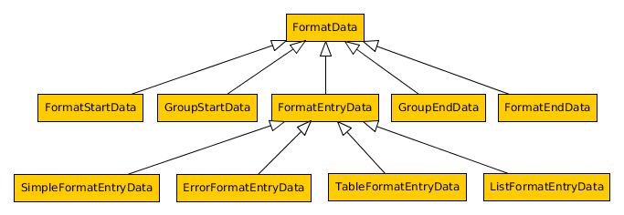
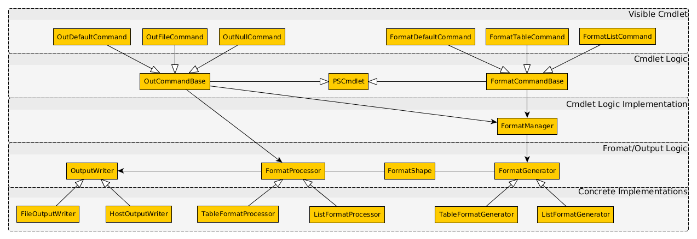

Format and Output
=================
A significant difference to Powershell that Pash users will quickly notice
is the output of cmdlets when Pash is used from the console.  While objects
are nicely formatted when printed in Powershell, Pash will most likely just
print all properties of an object, which can sometimes look quite messy.

This document should explain how formatting and output works in Powershell,
clarify why output still looks a little messy, and suggest how this can be
changed.

Format vs. Output
-----------------
In contrast to many other shells, Pash works object-oriented, so cmdlets
return objects and not just text. The upside is clearly the easy processing
of the output. The downside in regard to interactive shells is that object
just can't be printed directly.

Just like Powershell, Pash implicitly appends the `Out-Default` cmdlet
to any pipeline invoked from the console (not via the API, of course).
As the name suggests, this cmdlet will care about using the default
methods to print the result. However, taking a closer look to available
cmdlets, one will notice that there are different cmdlets that are
media dependent: `Out-File`, `Out-Host`, `Out-Printer`, and others.
Obviously they care about where the output should end up, but not
in which form.

This is the work of the `Format-*` cmdlet family with the prominent
examples `Format-Table` and `Format-List`. These cmdlets can be used
to process data *before* sending them to an output cmdlet.

    $data | Format-Table | Out-File foo.txt

This command will for example make sure that the object(s) in $data
will be in form of a table and then get written to `foo.txt`.
So `Format-Table` needs to create medium independent objects that
represent the formatted table.  As the explicit formatting step is
optional, a default formatting is simply applied implicitly by
the output cmdlets if the data is not yet formatted

Format
------
Investigating the output of the format cmdlets with Powershell/Pashs
built-in reflection tools as `Get-Type`, one can see that actually a
series of objects are created which are all of base type `FormatData`.
The following image shows an overview over the type hierarchy:

### Format Structure
As you can already imagine by their names, they can represent a whole
document with groups in the following form:

    FormatStartData,
    GroupStartData,
    FormatEntryData*,
    GroupEndData,
    FormatEndData

Each document can have several groups, and each group can have several entries.
The entries itself can then be of a derived type in the favored format, like
`TableFormatEntryData`.

Note that the subclassing behavior is not compatible with Powershell. But don't
worry, the only scenario where this would matter is when you would *format* your
data in Powershell and *print* it in Pash (or the other way around), which is
more than unlikely.

### Format Generation
For each *shape*, for example 'table' or 'list', there is one `FormatGenerator`
that is responsible for generating a series of `FromatData` objects that
represent the data in the designated shape. So this is where the real
formatting happens. The actual cmdlet logic is pretty much the same for all
`Format-*` cmdlets, so it's capsuled in a separate class `FormatManager` which
takes a `FormatShape` as an argument and cares about calling the correct
`FormatGenerator`.

This makes the extension for new formats pretty simple:
You would just need to add a new `FormatShape`, write the `FormatGenerator`
for your shape and add a cmdlet class that passes the correct shape to
the `FormatManager`.

Output
------
Similar as the format cmdlets, all output cmdlets work very similar, and just
write the formatted output to different media.  So what the different cmdlets
are actually doing is defining the output media type and leaving the work
to a capsuled base class `OutCommandBase`.  When this class processes data,
it will first check if the data is already `FormatData`. If not, it will
derive the default `FormatShape` from the data object and call the
`FormatManager`.

Having `FormatData` objects, it will create a media dependent `OutputWriter`
and a format dependent `FormatProcessor` that will use the `FormatData`
objects to write the output to the `OutputWriter`.

So for each media type, there is a `OutputWriter`, like `FileOutputWriter`
or `HostOutputWriter`. And in addition to a `FormatGenerator` for each
`FormatShape` there is a `FormatProcessor` that can process the objects
the corresponding `FormatGenerator` created. The following image shows
the complete class hierarchy and their connection of both the format and
output related classes:

Although this looks very complicated, it really isn't. All of the classes
do very little work. It's there dynamic interaction what makes the whole
formatting and output framework powerful and extensible at the same time.

Why it doesn't look nice, yet
-----------------------------
All that work and still no Powershell-like nice output? Well, the framework
to have nice output is ready. In fact, you could limit your output by using
the `Select-Object` cmdlet as in
    gci | select @{Name="Size"; Expression={$_.Length}}, LastWriteTime, Name}
This expression will list your current directory but only print Name,
LastWriteTime and the "Length" renamed to "Size" of the File objects as a table.

However, what we want in the long run is automatically doing this for certain
object types. However, as the "BlackMagic" module of Pash is currently broken,
this is something that has to be defined anywhere. In Powershell this is
defined in a file called `format.ps1xml`
(see https://technet.microsoft.com/en-us/library/hh847831.aspx).  In this
file, "views" can be defined, which include the properties of an object
to be displayed, the format shape, and even things like column size.

So in order to have nice views "automatically", we will need to integrate
the parsing and processing of this file, and write that file. Please see
[Issue #333](https://github.com/Pash-Project/Pash/issues/333) for more
detailed instructions for how this can be done.
